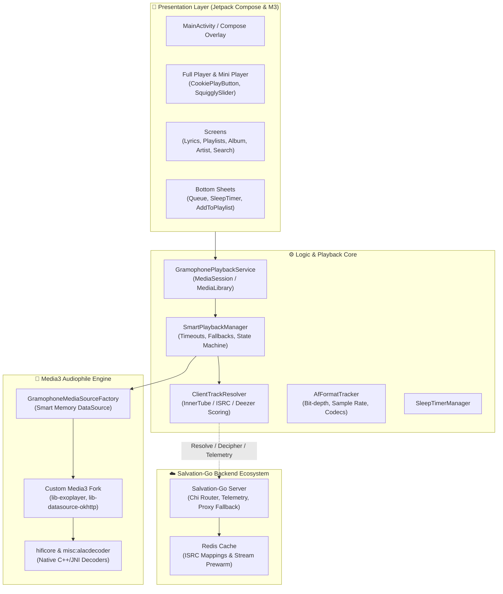

<div align="center">

# 🎵 Salvation

**Next-Generation High-Fidelity Music Streaming Client for Android**

[-3DDC84?style=for-the-badge&logo=android&logoColor=white)](https://android.com)
[](https://kotlinlang.org)
[](https://developer.android.com/jetpack/compose)
[](https://developer.android.com/media/media3)
[](LICENSE)

<p align="center">
  <b>Salvation</b> — это высокопроизводительный, легковесный музыкальный стриминговый плеер для Android с кастомным аудиотрактом, прямым клиентским резолвингом потоков, интеллектуальным буферизированием в RAM и выразительным интерфейсом Material 3 Expressive.
</p>

---

</div>

## 🌟 Ключевые возможности

### 🎧 Аудиофильский движок и производительность
* **Custom Media3 Fork & HiFiCore**: Глубоко модифицированный движок на базе AndroidX Media3 с нативными декодерами (включая ALAC/FLAC) и поддержкой bit-perfect воспроизведения.
* **Smart Memory DataSource**: Интеллектуальный RAM-буфер потокового аудио без постоянного износа флеш-памяти (zero disk wear) с предзагрузкой и защитой от сетевого троттлинга.
* **Прямой стриминг без кэширования на сервере**: Бэкенд не хранит временные файлы на диске, обеспечивая минимальные задержки и приватность.
* **Оптимизация соединений**: Пул постоянных HTTP/2 соединений OkHttp с автоматическим восстановлением при 403/416 ошибках и прозрачным прокси-фолбэком.
* **Энергоэффективность и контроль памяти**: Устранены утечки памяти при переключении треков, снижена нагрузка на GC и батарею устройства.

### 🔍 Интеллектуальный поиск и резолвинг треков
* **Многоуровневый каскад резолвинга (ClientTrackResolver)**: Поиск и извлечение аудиопотоков через каскад профилей (InnerTube, Android VR, Android Testsuite, Web Remix).
* **Точное сопоставление метаданных**: Интеграция с ISRC, Deezer API и YouTube Music с продвинутым алгоритмом скоринга (`ScoreCandidateV2`), транслитерацией и выделением базового названия (Core Title) без подмешивания ремастеров и каверов.
* **Встроенный JS Decipher Engine**: Локальная и серверная поддержка расшифровки cipher/n-параметров для обхода ограничений битрейта.

### 🎨 Material 3 Expressive UI & Дизайн
* **Современный стек**: Гибридная архитектура с активным переходом на декларативный **Jetpack Compose** и **Material You**.
* **Динамическая адаптация**: Поддержка Material You Dynamic Colors, автоматическое извлечение цветовой палитры из обложек релизов.
* **Кастомные интерактивные элементы**: Морфинг-кнопка воспроизведения `CookiePlayButton`, волнистый слайдер `SquigglySlider`, плавные анимации сплайнов и переходов к альбомам/артистам.
* **Синхронизированные тексты песен**: Интерактивный экран текстов (`LyricsScreen`) с автопрокруткой и интеграцией с агрегаторами.

### 🎛️ Продвинутое управление воспроизведением
* **Гибкие режимы повтора и шаффла**: Зацикливание одного трека, альбома или плейлиста без ложных пауз.
* **Управление очередью и плейлистами**: Полнофункциональный drag-and-drop редактор очереди и быстрое добавление в плейлисты.
* **Таймер сна (Sleep Timer)**: Плавное затухание громкости с настраиваемым таймером (`SleepTimerManager`).
* **Диагностика в реальном времени**: Встроенный логгер воспроизведения (`PlaybackLogger`) и отправка телеметрии для отладки стабильности сети.

---

## 🏗️ Архитектура приложения

Salvation построен по модульной архитектуре с четким разделением уровней ответственности:



### Структура модулей проекта

| Модуль | Назначение |
| :--- | :--- |
| **`:app`** | Основное Android-приложение: UI на Jetpack Compose, сервисы воспроизведения, медиа-сессия, управление плейлистами и настройками. |
| **`:hificore`** | Нативный аудиотракт, высокоточные фильтры и интеграция с аудио-интерфейсами Android HAL. |
| **`:media3`** *(included build)* | Локальный форк AndroidX Media3 с кастомными датасорсами (OkHttp HTTP/2 pool), оптимизацией под стриминг и расширенными кодеками. |
| **`:misc:alacdecoder`** | Нативный декодер Apple Lossless Audio Codec (ALAC) через JNI. |
| **`:misc:audiofx*`** | Модули расширения и мосты аудио-эффектов. |
| **`:baselineprofile`** | Модуль генерации Baseline Profiles для мгновенного холодного старта приложения. |

---

## 🛠️ Технологический стек

* **Язык**: [Kotlin 2.3.0](https://kotlinlang.org/) (JVM 21 target)
* **UI**: [Jetpack Compose](https://developer.android.com/jetpack/compose), Material Design 3 Expressive, Compose Navigation, Accompanist
* **Медиа и аудио**: AndroidX Media3 (custom fork), ExoPlayer, JNI/NDK C++ decoders
* **Асинхронность**: Kotlin Coroutines & Flow
* **Сеть**: OkHttp 5.x (HTTP/2, Connection Pooling, Interceptors), Retrofit, Kotlinx Serialization
* **Изображения**: [Coil](https://coil-kt.github.io/coil/) (с кастомными трансформациями и блюром)
* **База данных**: Room Persistence Library, SQLite, LikeCache
* **Бэкенд**: Go (Chi, GORM, Redis, Asynq, yt-dlp/InnerTube)

---

## 📂 Структура исходного кода (`:app`)

```text
app/src/main/java/org/akanework/gramophone/
├── logic/
│   ├── api/                     # Модели данных (Track, Album, Artist, Playlist)
│   ├── utils/
│   │   ├── exoplayer/           # ClientTrackResolver, GramophoneMediaSourceFactory
│   │   ├── AfFormatTracker.kt   # Детектор параметров аудиопотока в реальном времени
│   │   ├── SmartPlaybackManager.kt # Интеллектуальное управление воспроизведением и тайм-аутами
│   │   └── PlaybackLogger.kt    # Логгер событий и сетевой телеметрии
│   ├── GramophonePlaybackService.kt # Фоновый сервис MediaSession / MediaLibraryService
│   ├── LikeCashe.kt             # Быстрый кэш избранных треков
│   └── SleepTimerManager.kt     # Менеджер таймера сна
└── ui/
    ├── components/              # Compose-компоненты (LyricsScreen, SquigglySlider, CookieButton)
    ├── fragments/               # Экраны и BottomSheet-шторки
    └── MainActivity.kt          # Главный хост, Compose-оверлей плеера и навигация
```

---

## 🚀 Сборка и запуск

### Требования к окружению
* **Android Studio**: Ladybug / Meerkat (2024.2+) или новее
* **JDK**: 21 (Eclipse Temurin / OpenJDK)
* **Android SDK**: `compileSdk = 36`, `minSdk = 23`
* **NDK**: 26.x+ (для сборки C++ аудио-декодеров)

### Инструкция по сборке

1. Клонируйте репозиторий вместе с субмодулями:
   ```bash
   git clone https://github.com/Vanbayt/Salvation.git
   cd Salvation
   ```

2. Выполните сборку Debug APK:
   ```bash
   ./gradlew assembleDebug
   ```

3. Для сборки релизного APK с применением ProGuard/R8:
   ```bash
   ./gradlew assembleRelease
   ```

Готовый файл APK будет находиться по пути:
`app/build/outputs/apk/debug/app-debug.apk`

---

## 📄 Лицензия

Проект распространяется под условиями лицензии **GPLv3**. См. подробности в файле [LICENSE](LICENSE).

<div align="center">
  <sub>Разработано с заботой о звуке и вниманием к деталям.</sub>
</div>
